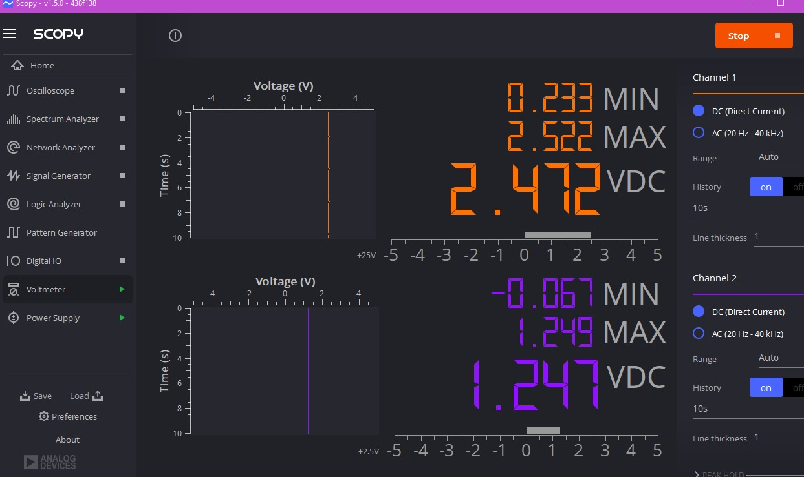
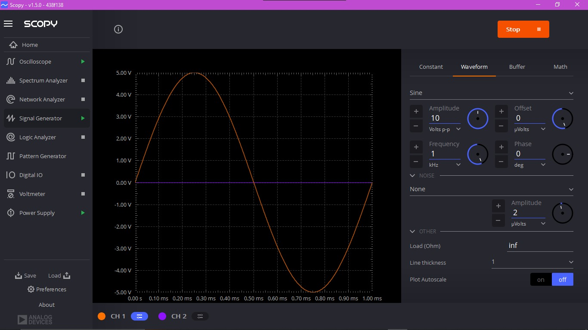
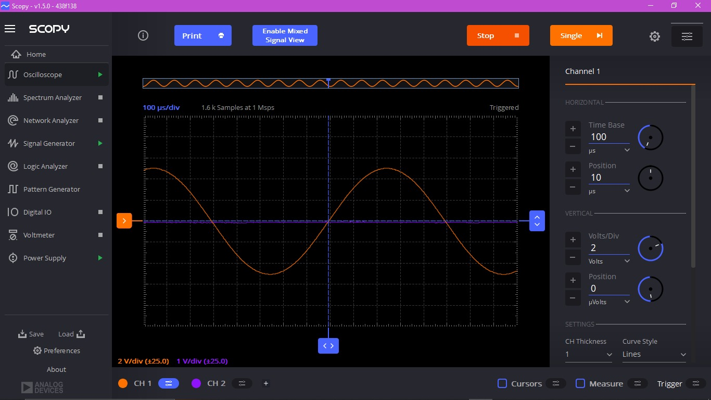
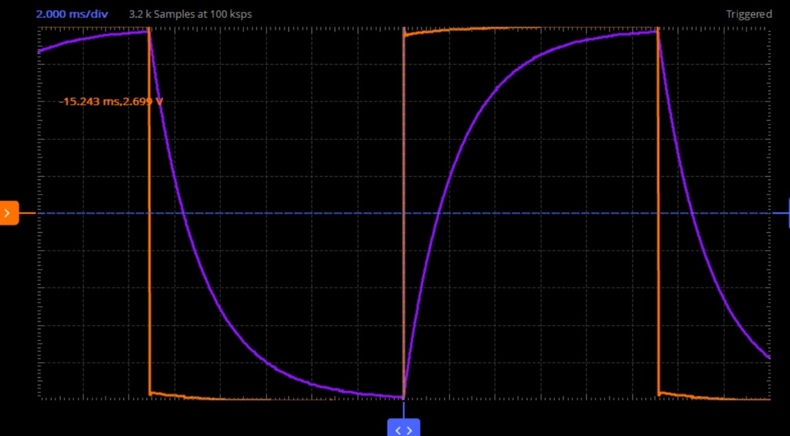
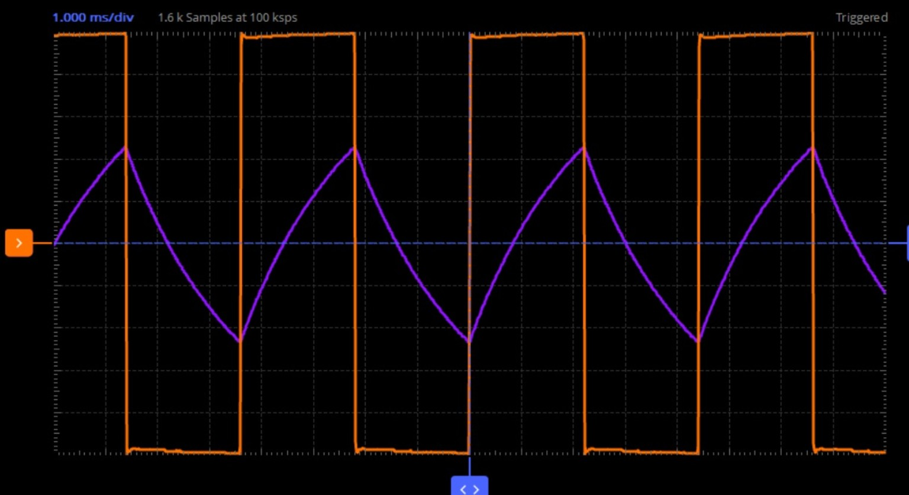

# ADALM 2000 Labs

## Experiment 1: Voltage Divider using ADALM2000 and Scopy

A voltage divider circuit was implemented using two equal resistors and tested using the ADALM2000 platform. The input and output voltages were measured using the Scopy Voltmeter tool. The measured output voltage was approximately half of the input voltage, demonstrating the voltage divider principle.

### Observation

The measured output voltage matched the expected voltage divider calculation. The input voltage was approximately **2.472 V**, while the output voltage was approximately **1.247 V**, confirming that the output is nearly half of the input voltage.

### Result

The voltage divider circuit was successfully implemented and verified using ADALM2000 and Scopy. The measured output voltage closely matched the theoretical value, confirming the correct operation of the voltage divider.

## Experiment 2: Frequency Generator and Oscilloscope Verification

A sine wave was generated using the Scopy Signal Generator and observed using the Oscilloscope.

The waveform was displayed correctly on the screen, confirming the proper operation of both instruments. This experiment demonstrated basic signal generation, waveform observation, and verification using the ADALM2000 platform.

### Observation

A stable sinusoidal waveform was observed on the oscilloscope display. The generated sine wave had the expected amplitude and frequency, indicating that both the Signal Generator and Oscilloscope were functioning correctly.

**INPUT SIGNAL**

**OUTPUT SIGNAL**

### Result

The generated sine wave was successfully displayed and verified using the ADALM2000 Signal Generator and Oscilloscope. The observed waveform matched the configured signal parameters, confirming the correct operation of both instruments.

## RC Circuit Response for Different Time Constants

The RC circuit was implemented using the ADALM2000 platform and Scopy software. The output response of the RC circuit was observed by varying the RC time constant (τ = RC) with respect to the input signal period (T).

### Observation

- **τ > T:** The capacitor charged and discharged slowly, producing a smooth exponential waveform that did not reach steady state within one cycle.

  

- **τ ≈ T:** Partial charging and discharging of the capacitor was observed. The output exhibited exponential rise and fall with noticeable attenuation.

  

- **τ < T:** The capacitor responded quickly to the input signal, and the output waveform closely resembled a triangular waveform due to rapid charging and discharging.

  

### Result

The RC circuit response was successfully verified for different values of the time constant. It was observed that increasing the RC time constant slows the charging and discharging process, while decreasing the time constant enables the circuit to follow the input signal more closely, resulting in a waveform approaching a triangular shape.
