# Xschem Schematics

# Lab 7: Microphone Amplifier Modeling and Simulation

## AC Simulation of the Microphone Amplifier

The microphone was modeled as an AC voltage source with an AC amplitude of 1 V. An AC analysis was performed to obtain the frequency response of the microphone amplifier. The transfer function magnitude was plotted in decibels along with its phase response. The gain at 1 kHz and the high-pass and low-pass cutoff frequencies (-3 dB) were determined using `.measure` commands.

## Observation

The AC frequency response of the microphone amplifier was obtained successfully. The amplifier exhibited a band-limited response with a nearly constant gain over the mid-frequency range. The measured gain at 1 kHz matched the expected value, while the high-pass and low-pass cutoff frequencies were identified from the −3 dB points of the response.

### Frequency Response

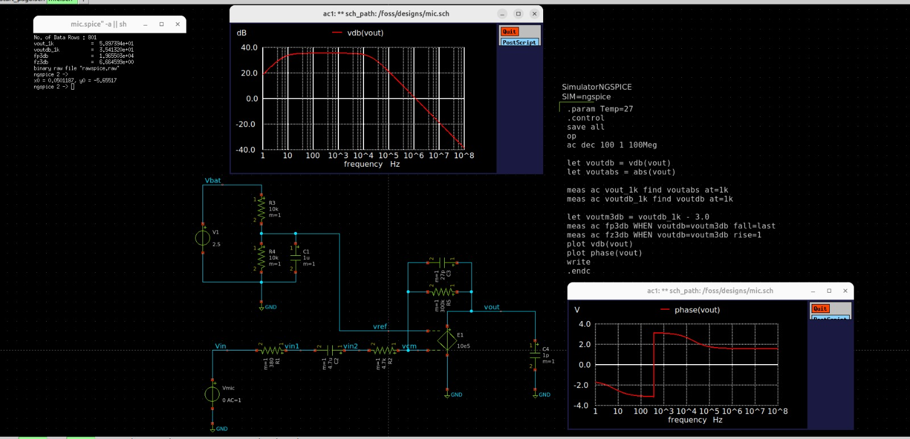

## Result

The AC simulation of the microphone amplifier was completed successfully. The magnitude and phase response were verified, and the gain at 1 kHz along with the high-pass and low-pass cutoff frequencies were measured. The simulation confirmed the expected frequency response of the microphone amplifier circuit.

## Power Supply Gain (PSRR) Measurement

The microphone input AC source was disabled by setting its AC value to zero, and the power supply voltage source was configured as the AC excitation. An AC analysis was performed to determine the power supply gain (PSRR) of the microphone amplifier. The output magnitude in decibels and phase response were measured over the specified frequency range.

### Observation

The power supply gain response was successfully obtained. The amplifier exhibited significant attenuation of power supply variations over the operating frequency range, indicating effective power supply rejection. The measured PSRR value confirmed that disturbances from the supply voltage were greatly suppressed at the output.

### AC Response

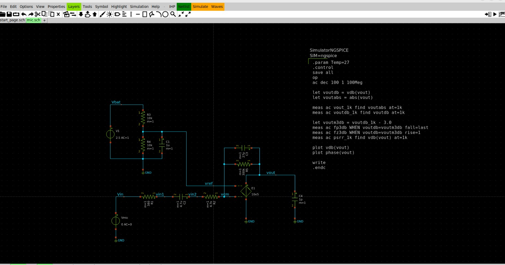

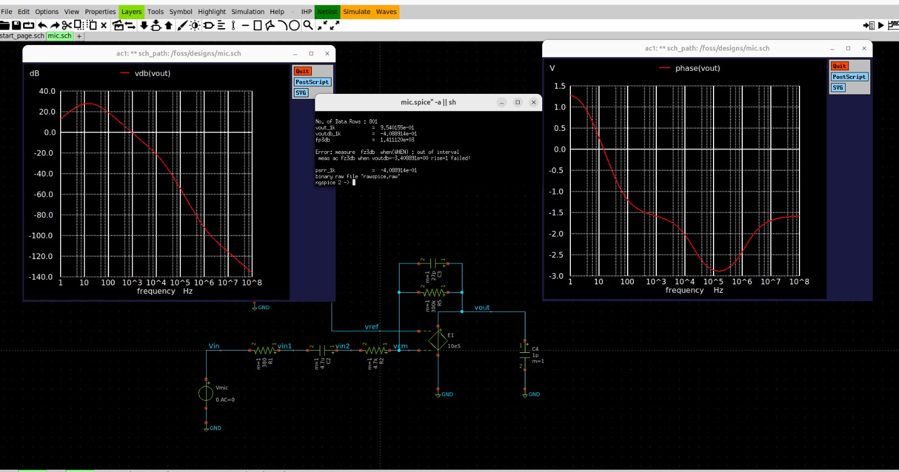

### Result

The power supply gain (PSRR) of the microphone amplifier was successfully measured using AC analysis. The simulation verified the circuit's ability to reject power supply noise, demonstrating stable amplifier operation and effective suppression of supply-induced disturbances.

## Transient Analysis of the Microphone Amplifier

A 1 kHz sinusoidal input signal with the amplitude obtained from the Thevenin equivalent model was applied to the microphone amplifier. Transient analysis was performed to measure the peak input voltage, peak output voltage, and voltage gain using the `.MEASURE` command. The same measurements were repeated for 1 Hz and 200 kHz input signals to evaluate the amplifier performance over different frequencies.

### Observation

The transient simulation was completed successfully. The input and output waveforms were observed simultaneously, and the measured peak voltages were used to calculate the voltage gain. At 1 kHz, the amplifier provided the expected mid-band gain with minimal waveform distortion. At 1 Hz, the output amplitude decreased due to the high-pass characteristics of the circuit, while at 200 kHz the gain reduced because of the low-pass response. These results closely matched the AC simulation.

### Transient Response

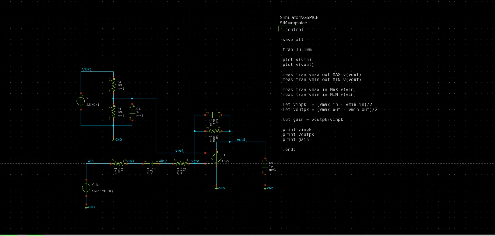

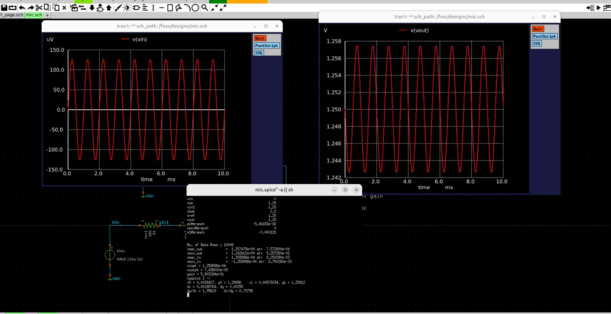

### Result

The transient analysis successfully verified the voltage gain of the microphone amplifier. The measured peak input and output voltages agreed with the theoretical and AC analysis results. The amplifier exhibited maximum gain around the mid-band frequency (1 kHz) and reduced gain at both low (1 Hz) and high (200 kHz) frequencies, confirming the expected frequency response of the amplifier.

## Single-Pole Op-Amp Model Verification

The operational amplifier was modeled as a single-pole amplifier using the dominant pole obtained from the datasheet. The previous AC and transient analyses were repeated to evaluate the effect of the finite bandwidth on the amplifier's frequency response and transient performance.

### Observation

The single-pole op-amp model was simulated successfully. The transient waveforms of the input and output signals were obtained, and the measured peak voltages were used to calculate the voltage gain. Compared with the ideal op-amp model, the output exhibited a slight reduction in gain and an increased phase delay at higher frequencies due to the dominant pole. The overall response closely followed the expected behavior of a practical operational amplifier.

### Simulation Result

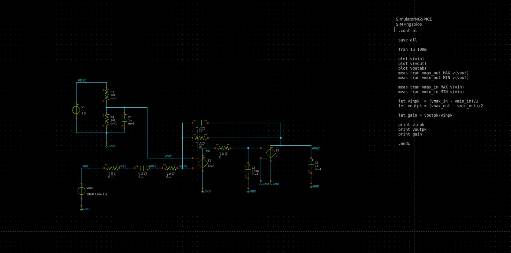

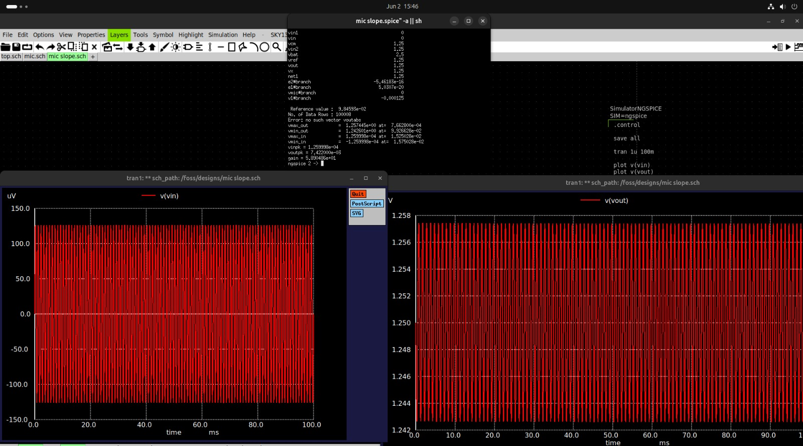

### Result

The practical single-pole op-amp model successfully demonstrated the non-ideal frequency response of the amplifier. The measured gain was consistent with the expected finite bandwidth characteristics obtained from the datasheet. The amplifier maintained the desired gain in the mid-band region while exhibiting gain roll-off and phase shift at higher frequencies, validating the practical op-amp model.

# Lab 10: MOS Parameter Extraction Using Ngspice

## a. Parameter Extraction of Level-1 MOS Model

The Level-1 NMOS model was simulated using NGSpice to extract the key device parameters including threshold voltage (Vt), transconductance parameter (KP), and body-effect coefficient (γ). A diode-connected NMOS configuration was used, and the square-root relationship between drain current and gate voltage was analyzed.

### Observation

The simulation executed successfully, and the √(2Id) versus VGS characteristic showed a linear relationship in the saturation region. The slope and intercept of the graph were used to determine the MOSFET parameters. The extracted values of KP and threshold voltage closely matched the specified Level-1 model parameters, confirming the correctness of the extraction method.

### Simulation Result

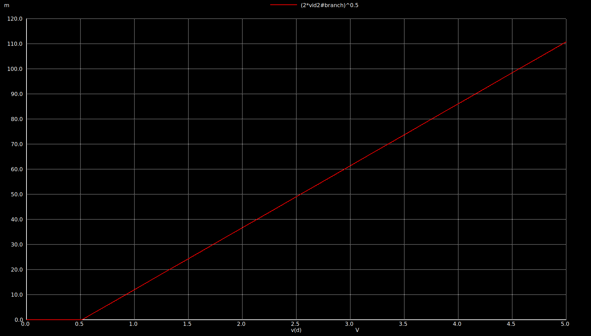

### Result

The Level-1 MOS model parameters were extracted successfully using NGSpice. The obtained values of threshold voltage (Vt), transconductance parameter (KP), and body-effect coefficient (γ) were consistent with the theoretical model, validating the parameter extraction procedure.

---

## b. Parameter Extraction for Level-49 BSIM Model

The Level-49 (BSIM) MOS model was simulated using the Sky130 process model. The drain current characteristics were analyzed, and the transistor parameters were extracted using the √Id versus VGS method. The extracted parameters were then compared with those obtained from the Level-1 model.

### Observation

The BSIM model simulation completed successfully, producing the expected √Id versus VGS characteristics. The extracted threshold voltage, transconductance parameter, and body-effect coefficient reflected the non-ideal behavior of a practical MOSFET model. The BSIM model exhibited more accurate device characteristics compared to the simplified Level-1 model.

### Simulation Result


### Result

The Level-49 BSIM MOS parameters were successfully extracted using NGSpice. The extracted parameters closely represented practical transistor behavior, demonstrating the improved accuracy of the BSIM model over the Level-1 model for modern CMOS device simulation.

## c. Level-1 vs Level-49 Comparison

The Level-1 and Level-49 (BSIM) NMOS models were simulated under identical operating conditions using NGSpice. The √(2Id) versus VGS characteristics of both models were plotted and compared to evaluate the difference between the simplified Level-1 model and the practical BSIM Level-49 model.

### Observation

Both MOS models exhibited the expected linear √(2Id) versus VGS relationship in the saturation region. The Level-1 model produced an ideal linear characteristic, while the Level-49 BSIM model showed slight deviations due to the inclusion of short-channel effects and other non-ideal transistor characteristics. The comparison demonstrated that the BSIM model provides a more realistic representation of practical MOSFET behavior.

### Simulation Result

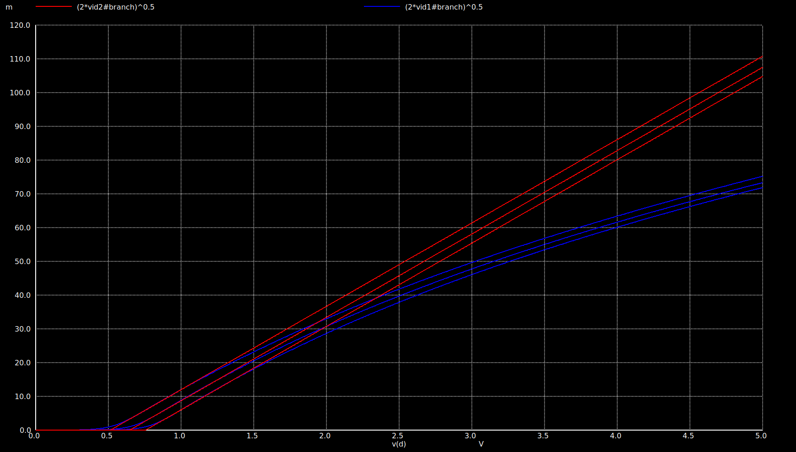

### Result

The comparison confirmed that the Level-49 BSIM model more accurately predicts practical MOSFET characteristics than the Level-1 model. Although both models follow the same general trend, the BSIM model incorporates second-order effects, making it more suitable for accurate CMOS circuit simulation and modern VLSI design.

 Differential Amplifier

## Circuit Diagram

The differential amplifier was implemented using matched NMOS and PMOS transistors from the TT model library. A current mirror provides the tail current while PMOS transistors form the active load. DC and AC analyses were carried out using NGSpice to study the operating point and frequency response.

### DC Analysis Commands

```spice
.dc V4 0 1.8 0.01

.control
run

PLOT i(V2) i(V5) i(V3)

PLOT v(Vm3) v(Vm4) v(V3)

.endc

.end
```

### Observation

The DC sweep verified the operation of the differential amplifier. The branch currents varied with the input voltage while the node voltages changed according to the differential pair operation. The active load and current mirror biased the circuit correctly over the operating range.

### Simulation Result

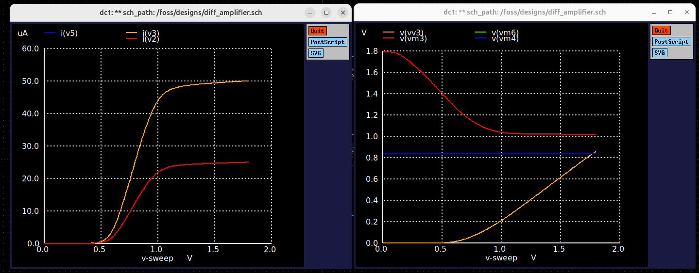

### Result

The differential amplifier achieved the expected DC operating point. The current mirror supplied the required bias current, and the differential pair operated correctly with balanced node voltages.

---

# AC Analysis of Differential Amplifier

The differential inputs were excited using equal-amplitude AC sources with opposite phases. AC analysis was performed to determine the differential gain and phase response of the amplifier.

### AC Analysis Commands

```spice
.ac dec 10 1 10G

.control
run

PLOT v(Vin1) v(Vin2)
PLOT v(Vm3)
PLOT vdb(Vm3)
PLOT ph(vm3)*(180/pi)

.endc

.end
```

### Observation

The AC simulation showed that the amplifier provides high gain within the mid-band region. The gain gradually decreases at higher frequencies due to the internal capacitances of the MOS transistors, while the phase shifts progressively with increasing frequency.

### Simulation Result

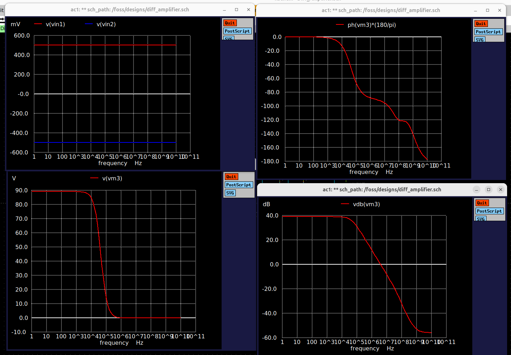

### Result

The AC analysis confirmed proper differential amplifier operation. A high mid-band gain was obtained with the expected roll-off and phase variation at higher frequencies, validating the designed frequency response.
