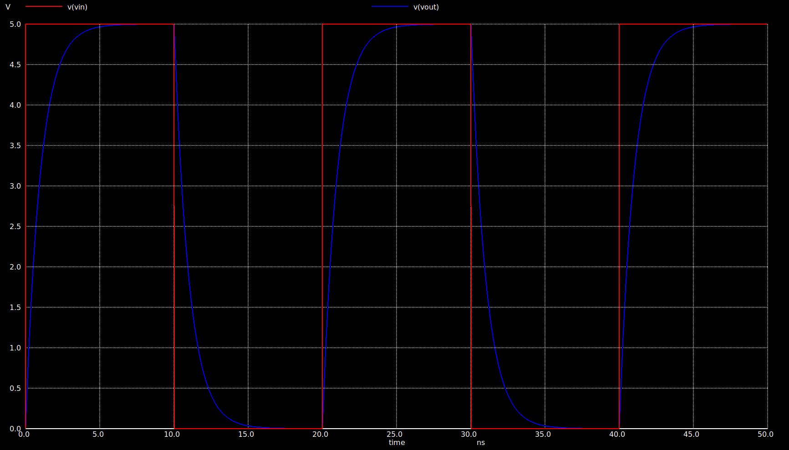
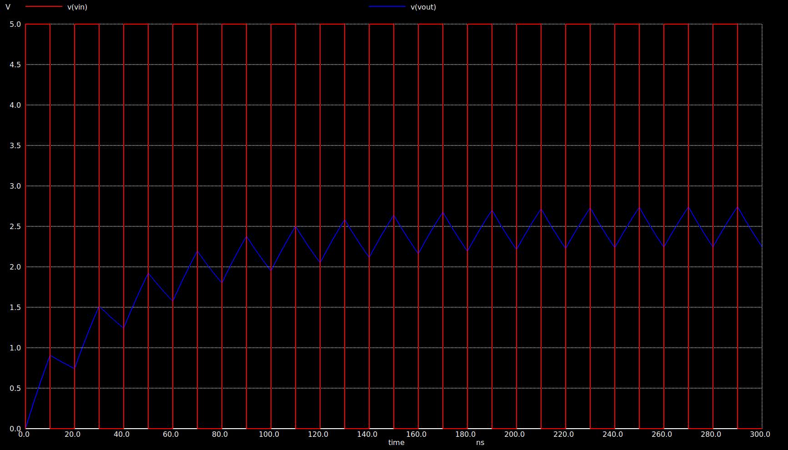
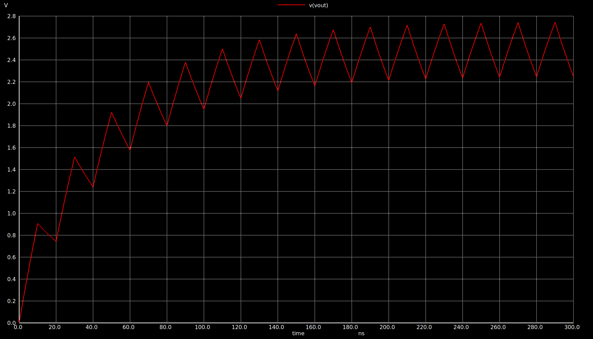
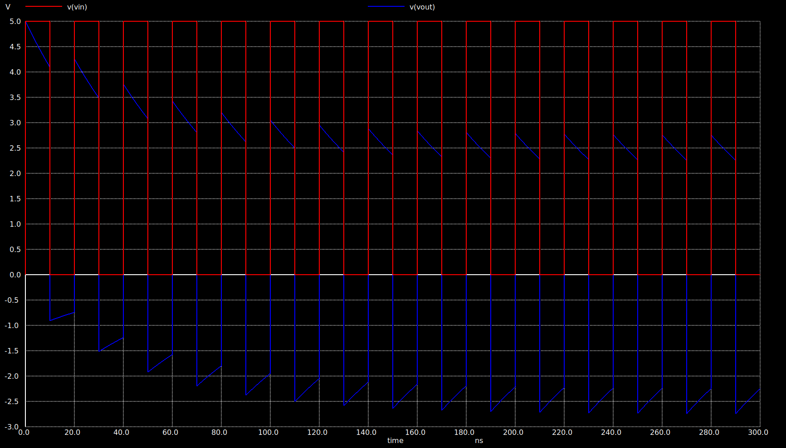

# ngspice 

## 1. VOLTAGE DIVIDER

Voltage Divider Netlist/Circuit was simulated successfully.

```spice
* This is netlist/circuit of a simple voltage divider

R1 vin vout 1K
R2 vout 0 1K

* Pulse Stimulus
Vpulse vin 0 PULSE(0 5 0.5u 10n 10n 0.5u 1u)

* Transient Analysis
.TRAN 0.1u 1.5u

.control
RUN
PLOT V(vout)
.endc

.end
```

### Observation

The output voltage is approximately half of the input voltage due to the equal resistor values used in the voltage divider circuit. The transient response confirms the expected voltage division behavior.


## 2. ID vs VGS

The variation of drain current with gate-source voltage was analyzed.

```spice
* Title: Id-vs-Vgs for NMOS in Saturation Region

* Level-1 Model
.MODEL nmos1 NMOS (LEVEL=1 PHI=0.846 VTO=0.514 KP=122U GAMMA=0.55 LAMBDA=0.0)

* Set the device temperature
.TEMP 27

* Netlist
M2 D2 D2 0 B nmos1 W=5u L=1u
Vds D 0 DC 5
Vid2 D D2 DC 0
Vsb 0 B DC 0

* DC Sweep Analysis
.DC Vds 0 5 0.001 Vsb 0 1 0.5

.CONTROL
RUN
PLOT Vid2#branch VS V(D)
PLOT (2*Vid2#branch)^0.5 VS V(D)
.ENDC

.END
```
### Observation

The drain current increases with increasing gate-source voltage, demonstrating the expected square-law behavior of the NMOS transistor in the saturation region. The characteristics also illustrate the effect of body bias on the device operation.

### ID vs VGS Plot


### √ID vs VGS Plot


## 1. RC CIRCUIT WITH STEP INPUT

The RC step response circuit was simulated successfully.

```spice
Title: RC Step Response

* RC Circuit
R1 vin vout 1e3
C1 vout 0 1p

* Pulse Stimulus
Vpulse vin 0 PULSE(0 5 2n 10p 10p 10n 20n)

.MEASURE TRAN tr1090 TRIG V(vout) VAL=0.5 RISE=1 TARG V(vout) VAL=4.5 RISE=1

* Transient Analysis
.TRAN 1p 30n

.control
RUN
PLOT V(vout)
.endc

.end
```

### Observation

The transient response of the RC circuit was analyzed using a step input. The capacitor charges exponentially when the input pulse goes high and discharges exponentially when the pulse returns low. The simulation verifies the expected charging and discharging characteristics of a first-order RC circuit.


## 2. RC CIRCUIT FREQUENCY RESPONSE

The frequency response of the RC circuit was analyzed successfully using AC analysis.

```spice
* This is a pulse stimulus with low voltage (v1=0V) and high voltage (v2=5V)
Vpulse vin 0 AC=1 PULSE(0 5 2n 10p 10p 10n 20n)

.MEASURE TRAN tr1090 TRIG v(vout) VAL=0.5 RISE=1 TARG v(vout) VAL=4.5 RISE=1

* Transient Analysis
*.TRAN step-size total-sim-time
*.TRAN 1p 30n

*.AC DEC 100 10 10e9
*.MEAS AC vdbmax MAX vdb(vout)
*.MEAS AC f3db WHEN vdb(vout)=v3db fall=last

.control
save all
AC DEC 100 10 10e9
MEAS AC vdbmax MAX vdb(vout)
LET v3db = vdbmax - 3.0
MEAS AC f3db WHEN vdb(vout)=v3db fall=last
write rc-step.raw

plot vdb(vout)

.endc

.end
```

### Observation

The AC frequency response of the RC circuit was analyzed using a Bode plot. The circuit exhibits a low-pass filter characteristic, maintaining nearly constant gain at low frequencies while attenuating higher-frequency signals beyond the cutoff frequency. The simulation verifies the expected first-order RC filter behavior.


## 1. RC CIRCUIT AS LOW PASS FILTER

### a. The RC circuit was simulated to measure the rise time and fall time of the output waveform.

```spice
* RC CIRCUIT

R1 Vin Vout 1k
C1 Vout 0 1p

* Pulse Input
Vpulse Vin 0 PULSE(0 5 0 10p 10p 10n 20n)

* Measure Rise Time (10% to 90%)
.measure tran trise
+TRIG V(Vout) VAL=0.5 RISE=1
+TARG V(Vout) VAL=4.5 RISE=1

* Measure Fall Time (90% to 10%)
.measure tran tfall
+TRIG V(Vout) VAL=4.5 FALL=1
+TARG V(Vout) VAL=0.5 FALL=1

.TRAN 1p 50n

.control
run
plot V(Vin) V(Vout)
.endc

.end
```

### Observation

The rise time and fall time of the RC low-pass filter were measured successfully. The output waveform shows the characteristic charging and discharging behavior of the capacitor, where the output gradually follows the input pulse due to the RC time constant.



### b. The RC circuit was simulated to determine the effective time constant.

#### RC Circuit with C = 50pF

```spice
* RC CKT WITH C=50p

R1 vin vout 1k
C1 vout 0 50p

Vpulse vin 0 PULSE(0 5 0 10p 10p 10n 20n)

* Effective time constant
.measure tran tau
+TRIG v(vout) VAL=3.15 RISE=1
+TARG v(vout) VAL=1.85 FALL=1

.TRAN 1p 300n

.control
run
plot v(vin) v(vout)
.endc

.end
```

### Observation

The effective time constant of the RC circuit with a 50 pF capacitor was measured successfully. The output waveform exhibits the expected charging and discharging behavior, validating the transient response of the RC network.



### c. RC Average Output

The average output voltage of the RC circuit was measured.

```spice
* RC average output

R1 vin vout 1k
C1 vout 0 50p

Vpulse vin 0 PULSE(0 5 0 10p 10p 10n 20n)

* Average output voltage
.measure tran avgout AVG v(vout) FROM=40n TO=80n

.tran 1p 300n

.control
run
plot v(vout)
.endc

.end
```

### Observation

The average output voltage of the RC circuit was obtained successfully. The output waveform reaches a steady-state average value after repeated charging and discharging of the capacitor.



### a. The RC high-pass filter was simulated to measure the rise time and fall time of the output waveform.

```spice
* RC high pass filter

C1 Vin Vout 1p
R1 Vout 0 1k

Vpulse Vin 0 PULSE(0 5 0 10p 10p 10n 20n)

* Rise Time
.measure tran trise
+TRIG V(Vout) VAL=0.5 RISE=1
+TARG V(Vout) VAL=4.5 RISE=1

* Fall Time
.measure tran tfall
+TRIG V(Vout) VAL=4.5 FALL=1
+TARG V(Vout) VAL=0.5 FALL=1

.tran 1p 50n

.control
run
plot V(Vin) V(Vout)
.endc

.end
```

### Observation

The rise time and fall time of the RC high-pass filter were measured successfully. The output waveform exhibits the expected transient response, where the capacitor passes high-frequency components while attenuating the steady-state (DC) component.


### b. The CR circuit was simulated to determine the effective time constant.

A CR high-pass circuit with a capacitance of **50 pF** was simulated to determine its effective time constant by observing the transient response of the output waveform.

```spice
* CR ckt with c=50p

C1 Vin Vout 50p
R1 Vout 0 1k

Vpulse Vin 0 PULSE(0 5 0 10p 10p 10n 20n)

* Effective Time Constant
.measure tran tau
+TRIG V(Vout) VAL=3.15 FALL=1
+TARG V(Vout) VAL=1.85 FALL=1

.tran 1p 300n

.control
run
plot V(Vin) V(Vout)
.endc

.end
```
### Observation

The effective time constant of the CR circuit was measured successfully. The output waveform shows the expected high-pass transient response, where the output initially changes rapidly and then decays exponentially toward zero with the circuit time constant.



### c. CR Circuit Average Output Voltage

The average output voltage of the CR circuit was measured.

```spice
* CR ckt average output voltage

C1 Vin Vout 50p
R1 Vout 0 1k

Vpulse Vin 0 PULSE(0 5 0 10p 10p 10n 20n)

* Average output voltage
.measure tran avgout AVG V(Vout) FROM=60n TO=100n

.tran 1p 100n

.control
run
plot V(Vout)
.endc

.end
```

### Observation

The average output voltage of the CR circuit was obtained successfully. The output waveform exhibits the expected exponentially decaying response of a high-pass RC circuit, and the measured average output voltage agrees with the transient behavior of the circuit.


